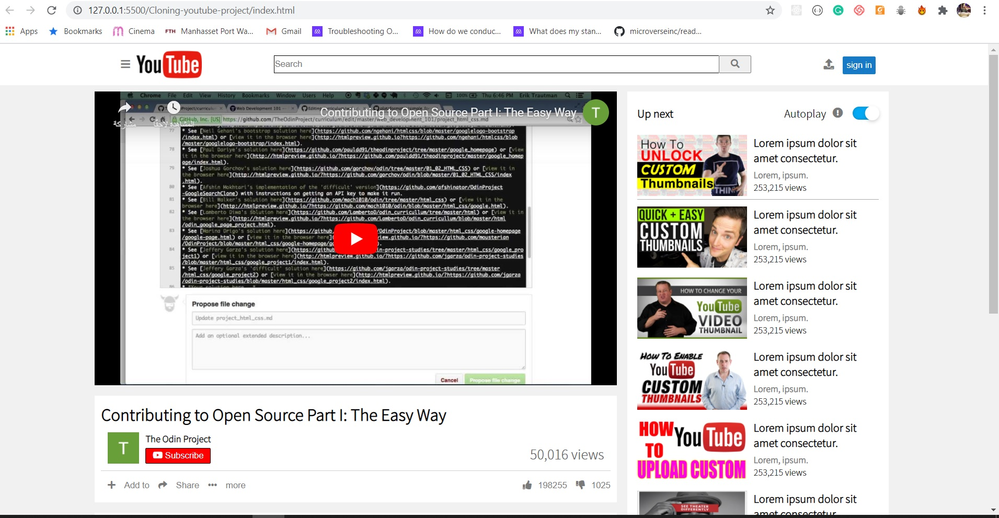

# Cloning-youtube-project

> This is a collaborative project which is about cloning a YouTube page. 

Additional description about the project and its features.

## Built With

- HTML5,
- CSS3

## Live Demo

[Live Demo Link](https://martinnajjar12.github.io/Cloning-youtube-project/)

## Getting Started

To get a local copy up and running follow these simple example steps.

### Prerequisites
> Any browser that is compatible with HTML5 and CSS3

## Authors

👤 **Author1**

- Github: [@Martin Najjar](https://github.com/martinnajjar12)
- Twitter: [@Martin Najjar](https://twitter.com/martin_najjar)
- Linkedin: [Martin Najjar](https://www.linkedin.com/in/martin-najjar-174948198/)

👤 **Author2**

- Github: [Tariq AbuFayad](https://github.com/tariqabufayad)
- Twitter: [Tariq AbuFayad](https://twitter.com/tareqabufayad)
- Linkedin: [Tariq AbuFayad](https://www.linkedin.com/in/tariq-ij-abufayad/)

## 🤝 Contributing

Contributions, issues and feature requests are welcome!

Feel free to check the [issues page](issues/).

## Show your support

Give a ⭐️ if you like this project!

## Acknowledgments

- Inspiration:   

## 📝 License

This project is [MIT](lic.url) licensed.
